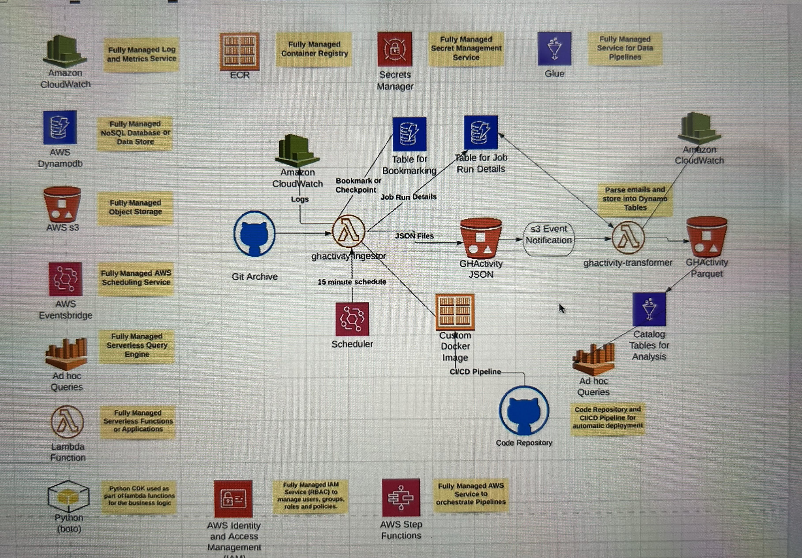
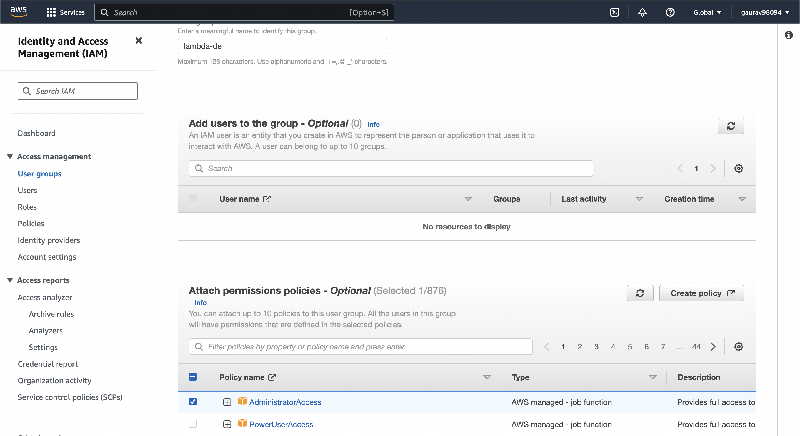
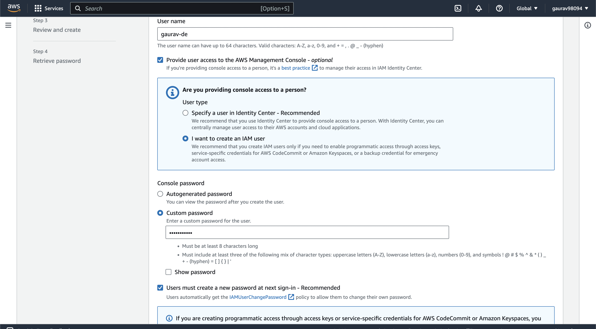
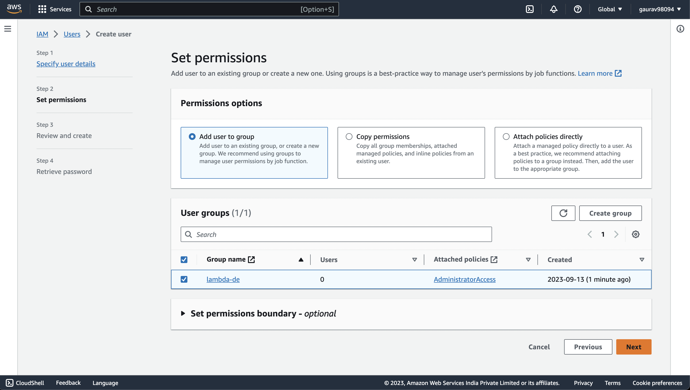

# AWS-Lambda-Serverless

## Project Architecture




### Setting Docker Desktop in 
<hr>

To install Docker on a Mac, you can use Docker Desktop, which provides a user-friendly interface and makes it easy to run and manage Docker containers on macOS. Here's how you can install Docker on your Mac:

1. **Check System Requirements**:

   Before you begin, make sure your Mac meets the following requirements:

   - macOS must be running macOS Yosemite 10.10.3 or later.
   - Your Mac must have a 64-bit Intel CPU (Apple Silicon is not officially supported as of my last knowledge update in September 2021).
   - Virtualization must be enabled in your BIOS/UEFI settings if it's not already enabled.

2. **Download Docker Desktop**:

   Visit the Docker Desktop for Mac download page: [Docker Desktop for Mac](https://www.docker.com/products/docker-desktop) and click on the "Download for Mac" button. You may need to create or sign in to your Docker Hub account to access the download.

3. **Install Docker Desktop**:

   Once the Docker Desktop .dmg file is downloaded, open it by double-clicking. Drag the Docker icon into your Applications folder. This will install Docker Desktop on your Mac.

4. **Run Docker Desktop**:

   After installation, open Docker Desktop from your Applications folder. It will prompt you for your system password to complete the installation process.

5. **Enable Docker**:

   Docker Desktop will start running, and you'll see the Docker icon in your Mac's menu bar. Click on it, and you can access Docker settings and status.

6. **Test Docker Installation**:

   Open a terminal window and run the following command to check if Docker is installed and running properly:

   ```bash
   docker --version
   ```

   You should see the Docker version information if it's installed correctly.

7. **Run a Test Container**:

   To test Docker further, you can run a simple container:

   ```bash
   docker run hello-world
   ```

   This command will download a small Docker image and run a container from it. If everything is set up correctly, you should see a message confirming that your installation appears to be working correctly.

That's it! You've successfully installed Docker on your Mac using Docker Desktop. You can now start creating and managing containers on your macOS system.

<hr>

### Create IAM User


1. **Sign In to AWS Console**:

   Log in to your AWS Management Console using an account with administrative privileges.

2. **Open IAM Dashboard**:

   Once you're logged in, navigate to the IAM (Identity and Access Management) service by searching for "IAM" in the AWS Management Console search bar or by selecting it from the "Security, Identity, & Compliance" section.

    

3. **Create a New IAM User**:

   In the IAM dashboard, select "Users" from the left-hand navigation pane and then click the "Add user" button.

4. **Configure User Details**:

   - Enter the username for the new IAM user.
   - Choose the type of access. For this example, select "Programmatic access" (to allow the user to interact with AWS via APIs) and "AWS Management Console access" (to allow access to the AWS Management Console).
   - Optionally, you can set a custom password or let AWS auto-generate one.
   - You can require the user to reset their password on their first login for security reasons, or you can choose not to enforce a password change.
   
   
   

5. **Permissions**:

   In the "Set permissions" step:
   
   - Select "Add user to group" and choose an existing group with administrator access policies (e.g., the built-in "Administrators" group). This is the fastest way to give the user administrator access.
   - Alternatively, you can attach policies directly to the user by selecting "Attach existing policies directly." In this case, search for and attach the "AdministratorAccess" policy, which provides full administrative access.

   

6. **Tags (Optional)**:

   You can add tags to the user if needed. Tags are key-value pairs that help you categorize and manage users.

7. **Review**:

   Review the user details, permissions, and settings to ensure they are correct. If everything looks good, click the "Create user" button.

8. **Success**:

   You will see a confirmation page with the user's access keys (if programmatic access was enabled). Make sure to save these credentials securely because you won't be able to see the secret key again.

9. **Send Welcome Email** (Optional):

   If you provided an email address during user creation, you can send a welcome email with login details to the user. This step is optional.

That's it! You've successfully created an IAM user with administrator access in AWS. This user will have full access to AWS services and resources, so be sure to manage their credentials securely.


## Read from DynamoDB
```python
def get_job_details(job_name):
    dynamodb = boto3.resource('dynamodb')
    table = dynamodb.Table('jobs')
    job_details = table.get_item(Key={'job_id': job_name})['Item']
    return job_details
```

### Save job details to DynamoDB
```python

def get_next_file_name(job_details):
    job_start_time = get_job_start_time()
    job_run_bookmark_details = job_details.get('job_run_bookmark_details')
    baseline_days = int(job_details['baseline_days'])
    if job_run_bookmark_details:
        dt_part = job_run_bookmark_details['last_run_file_name'].split('.')[0].split('/')[-1]
        next_file_name = f"{dt.strftime(dt.strptime(dt_part, '%Y-%m-%d-%H') + td(hours=1), '%Y-%m-%d-%-H')}.json.gz"
    else:
        next_file_name = f'{dt.strftime(dt.now().date() - td(days=baseline_days), "%Y-%m-%d")}-0.json.gz'
    return job_start_time, next_file_name


def save_job_run_details(job_details, job_run_details, job_start_time):
    dynamodb = boto3.resource('dynamodb')
    job_run_details_item = {
        'job_id': job_details['job_id'],
        'job_run_time': job_start_time,
        'job_run_bookmark_details': job_run_details,
        'create_ts': int(time.mktime(dt.now().timetuple()))
    }
    job_run_details_table = dynamodb.Table('job_run_details')
    job_run_details_table.put_item(Item=job_run_details_item)
    
    job_details_table = dynamodb.Table('jobs')
    job_details['job_run_bookmark_details'] = job_run_details
    job_details_table.put_item(Item=job_details)
```

## Ingest Data
```python
def upload_file_to_s3(file_name, bucket_name, folder):
   print(f'Getting the {file_name} from gharchive')
   res = requests.get(f'https://data.gharchive.org/{file_name}')

   print(f'Uploading {file_name} to s3 under s3://{bucket_name}/{folder}')
   s3_client = boto3.client('s3')
   upload_res = s3_client.put_object(
      Bucket=bucket_name,
      Key=f'{folder}/{file_name}',
      Body=res.content
   )

   return {
      'last_run_file_name': f's3://{bucket_name}/{folder}/{file_name}',
      'status_code': upload_res['ResponseMetadata']['HTTPStatusCode']
   }
```

## Transformtion
COnverting Json to Parquet

```python

import uuid
import pandas as pd


def transform_to_parquet(file_name, bucket_name, tgt_folder):
    print(f'Creating JSON Reader for {file_name}')
    df_reader = pd.read_json(
        f's3://{bucket_name}/landing/ghactivity/{file_name}',
        lines=True,
        orient='records',
        chunksize=10000
    )
    year = file_name.split('-')[0]
    month = file_name.split('-')[1]
    dayofmonth = file_name.split('-')[2]
    hour = file_name.split('-')[3].split('.')[0]
    print(f'Transforming JSON to Parquet for {file_name}')
    for idx, df in enumerate(df_reader):
        target_file_name = f'part-{year}-{month}-{dayofmonth}-{hour}-{uuid.uuid1()}.snappy.parquet'
        print(f'Processing chunk {idx} of size {df.shape[0]} from {file_name}')
        df.drop(columns=['payload']). \
        to_parquet(
            f's3://{bucket_name}/{tgt_folder}/year={year}/month={month}/dayofmonth={dayofmonth}/{target_file_name}',
            index=False
        )

    return {
        'last_run_src_file_name': file_name,
        'last_run_tgt_file_pattern': f's3://{bucket_name}/{tgt_folder}/year={year}/month={month}/dayofmonth={dayofmonth}/part-{year}-{month}-{dayofmonth}-{hour}',
        'status_code': 200
    }
    
```

## Scheduling Ingester using EventBridge

To schedule a Lambda function to run every 15 minutes using Amazon EventBridge, you can create a rule that triggers your Lambda function at the desired interval. Here are the steps to set up this scheduling:

1. **Create or Identify Your Lambda Function:**
   Ensure that you have a Lambda function you want to run at 15-minute intervals.

2. **Create an EventBridge Rule:**
   Go to the AWS Management Console and navigate to the EventBridge service.

3. **Create a Rule:**
   Click on "Create Rule" to create a new rule. In the "Define rule" section:

   - **Name:** Give your rule a descriptive name.
   - **Description:** Add a brief description if necessary.

4. **Define Event Source:**
   In the "Define event source" section:

   - For "Event Source," select "Event Source" as "Event Source Type."
   - For "Event bus," you can choose the default event bus or create a custom one if needed.

5. **Define Pattern:**
   In the "Define pattern" section:

   - For "Event matching pattern," you can leave it as "Event matching pattern."
   - For "Event source," you can specify the source that should trigger your Lambda function.
   - For "Event detail type," you can choose "Event detail type" if your Lambda function doesn't require specific event details.

6. **Create Schedule Expression:**
   In the "Schedule" section, you'll need to create a cron-like expression to specify the 15-minute interval. Use the following expression:

   ```
   rate(15 minutes)
   ```

   This expression will trigger your Lambda function every 15 minutes.

7. **Define Targets:**
   In the "Define targets" section:

   - Click "Add target."
   - Select "Lambda function" as the target type.
   - Choose your Lambda function from the list.

8. **Configure Input (Optional):**
   If your Lambda function requires specific input, you can configure it in the "Configure input" section.

9. **Create Rule:**
   Review the rule configuration and click "Create rule" to save it.

Now, Lambda function will be triggered every 15 minutes according to the schedule expression you defined. Make sure to test the rule to ensure it's working as expected. You can also monitor the execution of your Lambda function in the AWS Lambda Console and view any associated logs for debugging if necessary.


<hr>

## Glue Catalog

Glue is a fully managed ETL (Extract, Transform, Load) service provided by AWS. Here's a step-by-step guide to create a Glue catalog and database for data in S3:

1. **Sign in to the AWS Management Console**:
   Make sure you have an AWS account and are signed in to the AWS Management Console.

2. **Open AWS Glue**:
   Go to the AWS Glue Console by searching for "Glue" in the AWS Console's search bar.

3. **Create a Glue Database**:
   - In the AWS Glue Console, navigate to the "Databases" section on the left-hand side.
   - Click the "Add database" button.
   - Provide a name for your database (e.g., "MyDatabase").
   - Optionally, you can add a description.
   - Click "Create" to create the database.

4. **Create a Glue Crawler**:
   A crawler is used to discover and catalog data stored in your S3 bucket.

   - In the AWS Glue Console, navigate to the "Crawlers" section on the left-hand side.
   - Click the "Add crawler" button.
   - Provide a name for your crawler (e.g., "MyCrawler").
   - Choose a data store as "S3" and provide the path to your S3 bucket.
   - Choose an existing IAM role or create a new one with the necessary permissions for Glue to access your S3 data.
   - Click "Next."
   - Add any additional data sources or exclude patterns if needed.
   - Review the configuration and click "Next."
   - Set up a schedule for running the crawler if you want it to run periodically or run it manually.
   - Review the final configuration and click "Finish."

5. **Run the Crawler**:
   - Select the crawler you just created in the AWS Glue Console.
   - Click the "Run crawler" button to start the crawling process. The crawler will analyze the data in your S3 bucket and populate the Glue catalog.

6. **Check the Catalog**:
   - Once the crawler has finished running, go back to the "Databases" section in the AWS Glue Console.
   - Select the database you created earlier (e.g., "MyDatabase").
   - You should see tables corresponding to the data discovered in your S3 bucket.

7. **Query the Data**:
   - You can now use the Glue catalog to run SQL queries or perform ETL operations on your data using AWS Glue jobs.

Your Glue catalog and database are now set up and ready to be used with the data stored in your S3 bucket. You can create Glue jobs, transformations, and other ETL processes to work with this data.


<hr>

## Adding Layers to Lambda

- *Create a folder name dep*
```bash
mkdir dep
```

- *Install all dependencies*
```bash
python3 -m pip install pandas -t dep
python3 -m pip install requests -t dep
```
Note : Overall size of layes file cannot exceed above 256 MB
```bash
du -sh dep/
```

- * Zip the file*
```bash
zip -r layer.zip dep
```

- *Upload the zip file to s3*
```bash
aws s3 cp layer.zip s3://project
```

- *Now you can upload layer in AWS Lambda upload layer option*